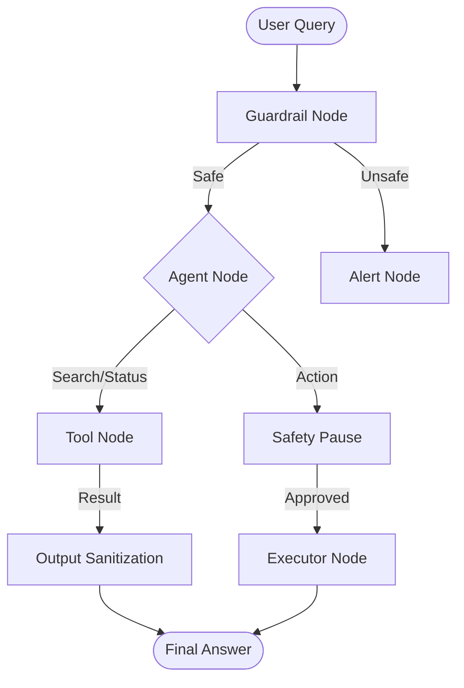

# 🤖 HR Onboarding Automation Agent
**Industrial-Grade AI Agent for Seamless Employee Onboarding**

[](https://www.python.org/downloads/release/python-3110/)
[](https://github.com/langchain-ai/langgraph)
[](https://www.docker.com/)
[](https://opensource.org/licenses/MIT)

## 🌟 Overview
The **HR Onboarding Automation Agent** is a sophisticated, multi-agent system designed to solve the complexity of corporate onboarding. Built using **LangGraph**, it moves beyond simple chatbots to provide a reliable, secure, and stateful orchestration of tasks including document retrieval, risk assessment, and manager communications.

### 🚀 Key Capabilities
*   **Multi-Agent Team**: Collaborative execution between a **Researcher** (evidence gathering) and an **Analyst** (synthesis).
*   **Intelligent RAG**: Context-aware retrieval from HR policies and employee records using **ChromaDB**.
*   **Human-in-the-Loop (HITL)**: Safety breakpoints for high-risk actions (e.g., email dispatch) requiring manual approval.
*   **Robust Security**: Integrated guardrails for prompt injection defense and PII redaction.
*   **Observability & Monitoring**: Real-time tracing with **LangSmith** and a dedicated **Drift Monitoring** dashboard.

---

## 🏗️ Architecture
The system follows a directed cyclic graph (DCG) pattern for robust state management and error handling.



---

## 📂 Project Structure
```bash
hr-onboarding-agent/
├── app.py                # Streamlit Frontend (Feedback UI)
├── main.py               # FastAPI Backend (Streaming SSE)
├── graph.py              # Core LangGraph Implementation
├── multi_agent_graph.py  # Team-based Orchestration
├── secured_graph.py      # Security-hardened Graph
├── tools/                # Pydantic-validated Tools
├── ingest_data.py        # RAG Ingestion Pipeline
├── guardrails_config.py  # Security Patterns & Logic
├── analyze_feedback.py   # Drift Monitoring Script
├── Dockerfile            # Containerization
└── docs/                 # Detailed Lab Reports & PRD
```

---

## 🛠️ Tech Stack
*   **Core**: Python 3.11, LangGraph, LangChain
*   **Vector DB**: ChromaDB
*   **API**: FastAPI, Uvicorn
*   **Frontend**: Streamlit
*   **Security**: Pydantic, Regex-based Rails
*   **DevOps**: Docker, Docker Compose, GitHub Actions

---

## ⚙️ Setup & Installation

### 1. Clone the Repository
```bash
git clone https://github.com/abeeranajam31/HR-Onboarding-Automation-Agent-using-Langraph.git
cd hr-onboarding-agent
```

### 2. Environment Configuration
Create a `.env` file in the root directory:
```env
OPENAI_API_KEY=your_api_key
LANGSMITH_API_KEY=your_langsmith_key (optional)
CHECKPOINT_DB_PATH=persistence/checkpoints/checkpoint_db.sqlite
```

### 3. Run with Docker (Recommended)
```bash
docker compose up --build
```
*   **API**: `http://localhost:8000`
*   **UI**: `http://localhost:8501`

### 4. Manual Installation
```bash
python -m venv .venv
source .venv/bin/activate
pip install -r requirements.txt
python ingest_data.py
python main.py
```

---

## 🧪 Lab Breakdown (Full Lifecycle)
The project is organized into 11 distinct labs covering the entire AI development lifecycle:
1.  **Problem Framing**: PRD and strategic alignment.
2.  **Knowledge Engineering**: RAG pipeline and vector indexing.
3.  **Reasoning Loop**: ReAct agent implementation.
4.  **Multi-Agent**: Collaborative personas.
5.  **State Management**: Persistence and HITL.
6.  **Security**: Input/Output guardrails.
7.  **Evaluation**: Quantitative audit with RAGAS/DeepEval.
8.  **API Layer**: RESTful streaming endpoints.
9.  **Packaging**: Docker containerization.
10. **CI/CD**: Automated quality gates.
11. **Drift Monitoring**: Post-deployment feedback loops.

---

## 📝 License
This project is licensed under the MIT License.

---
**Developed by Student 2022038** | *Advancing Agentic AI in Enterprise HR*
